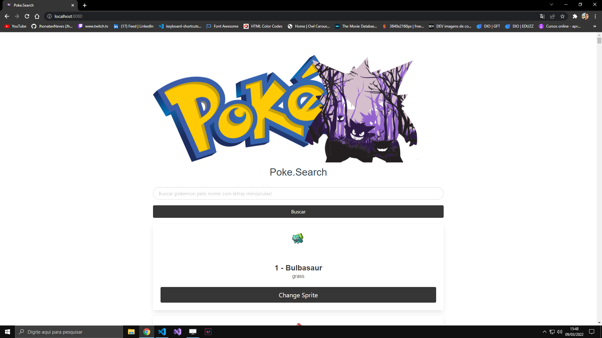
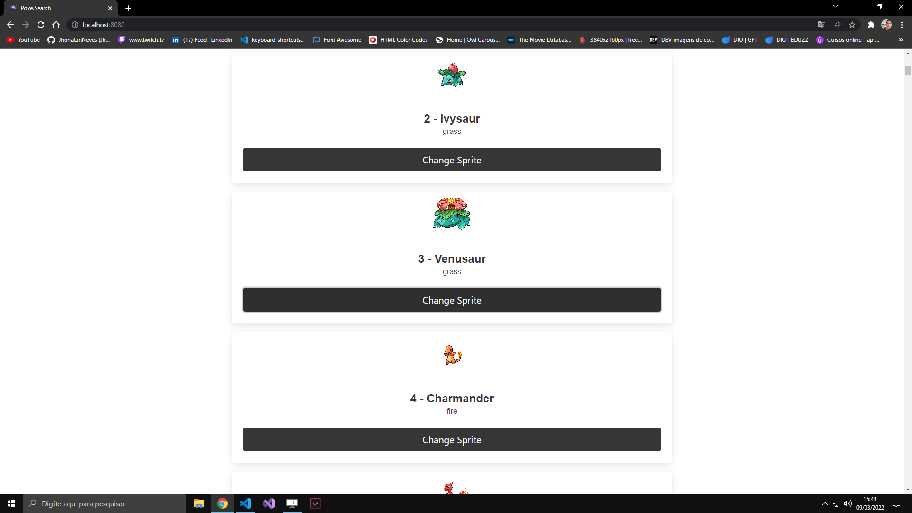
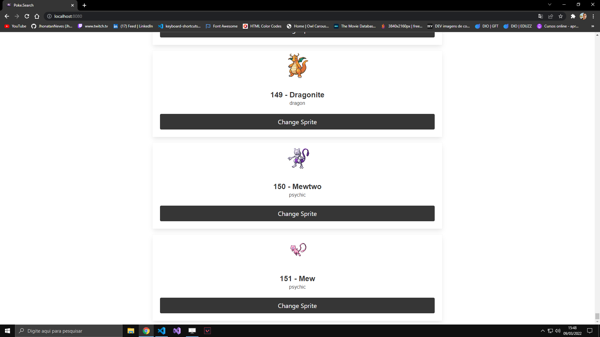
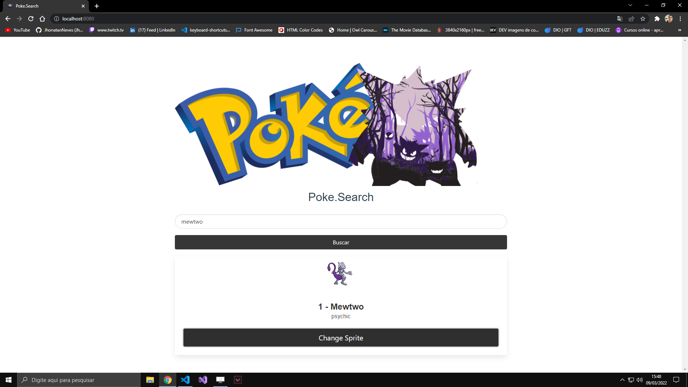
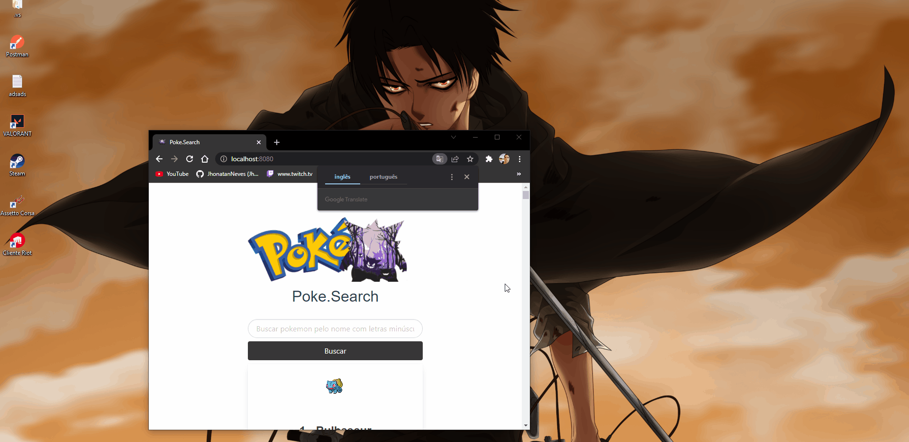

# PokeSearch

Esta é uma PokeSearch feita em Vue.js.

Site construido com Vuejs usando axios e bulma, Sistema de busca atraves de API externa.

### Features

-   [x] Buscar pokemon pelo nome
-   [x] Alterar Sprite
